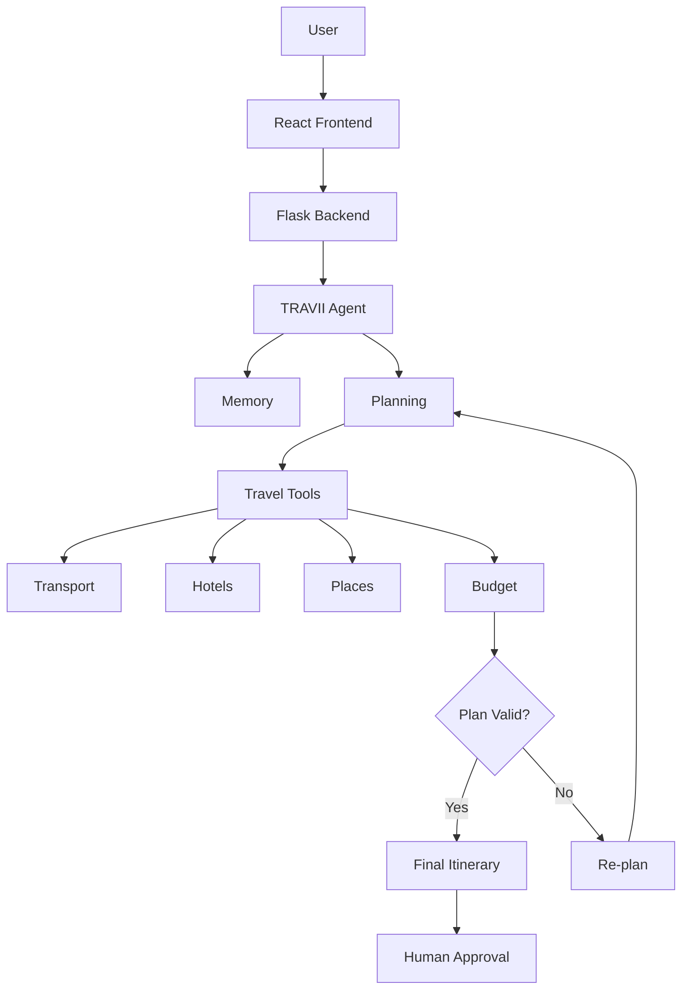

```mermaid
flowchart TD

A[User] --> B[React Frontend]

B --> C[Flask Backend]

C --> D[TRAVII Agent]

D --> E[Memory]

D --> F[Planning]

F --> G[Travel Tools]

G --> H[Transport]

G --> I[Hotels]

G --> J[Places]

G --> K[Budget]

K --> L{Plan Valid?}

L -->|Yes| M[Final Itinerary]

L -->|No| N[Re-plan]

N --> F

M --> O[Human Approval]
```
